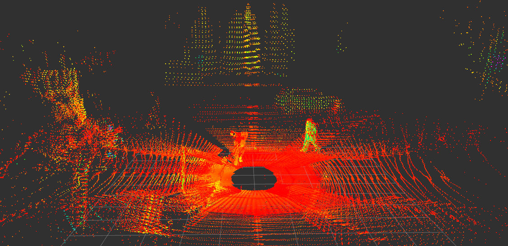
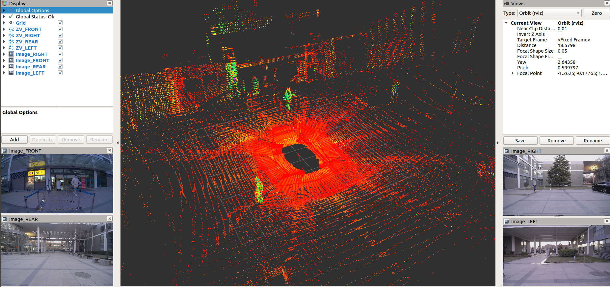
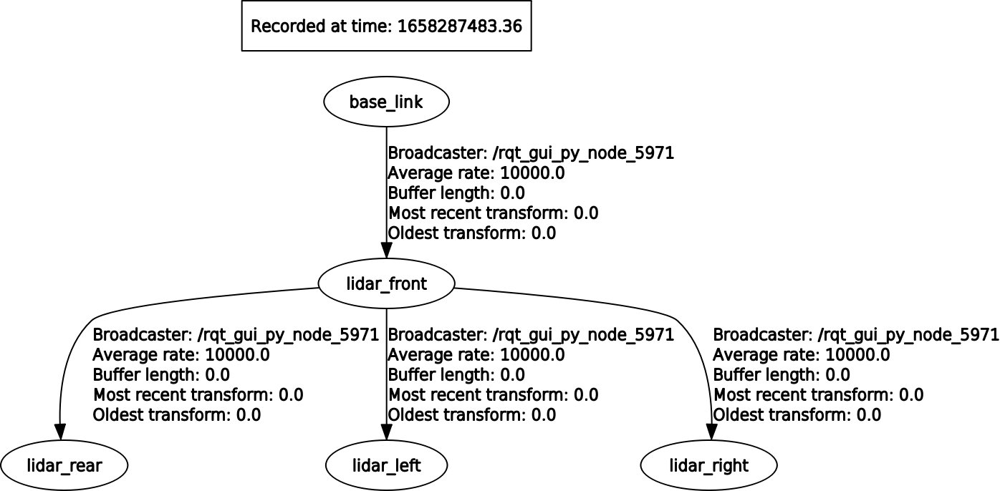

# zvision_ugv_data
This repo contains links of data collected by ugv, including pointcloud, image, rtk-gnss-ins data and tf.

## Data Links
### ROS2 Bags:
* BaiduNetdisk:  
Link：https://pan.baidu.com/s/1gtbB_IxbHYlYXaoJEeHMcA  
Access Code：u8as 
## Data Structure
### LiDARs

| topic                     | frame_id    | type                    |
| ------------------------- | ----------- | ----------------------- |
| /ns1/zvision_lidar_points | lidar_front | sensor_msgs/PointCloud2 |
| /ns2/zvision_lidar_points | lidar_right | sensor_msgs/PointCloud2 |
| /ns3/zvision_lidar_points | lidar_rear  | sensor_msgs/PointCloud2 |
| /ns4/zvision_lidar_points | lidar_left  | sensor_msgs/PointCloud2 |

### Cameras

| topic                             | frame_id     | type                        |
| --------------------------------- | ------------ | --------------------------- |
| /ns1/image_raw/compressed         | camera_front | sensor_msgs/CompressedImage |
| /ns2/usb_cam/image_raw/compressed | camera_right | sensor_msgs/CompressedImage |
| /ns3/usb_cam/image_raw/compressed | camera_rear  | sensor_msgs/CompressedImage |
| /ns4/usb_cam/image_raw/compressed | camera_left  | sensor_msgs/CompressedImage |

### RTK-GNSS & INS

| topics                | frame_id             | type                                |
| --------------------- | -------------------- | ----------------------------------- |
| /navsat/fix           |                      | sensor_msgs/NavSatFix               |
| /novatel/inspva       | imu                  | imu_msgs/novatel_inspva(custom msg) |
| /novatel/pose_stamped | imu                  | geometry_msgs/PoseStamped           |
| /novatel/raw          | imu                  | sensor_msgs/Imu                     |
| /ns1/zvision_imu      | zvision_imu(default) | sensor_msgs/Imu                     |
| /ns2/zvision_imu      | zvision_imu          | sensor_msgs/Imu                     |
| /ns3/zvision_imu      | zvision_imu          | sensor_msgs/Imu                     |
| /ns4/zvision_imu      | zvision_imu          | sensor_msgs/Imu                     |

### TF

tf_static:

